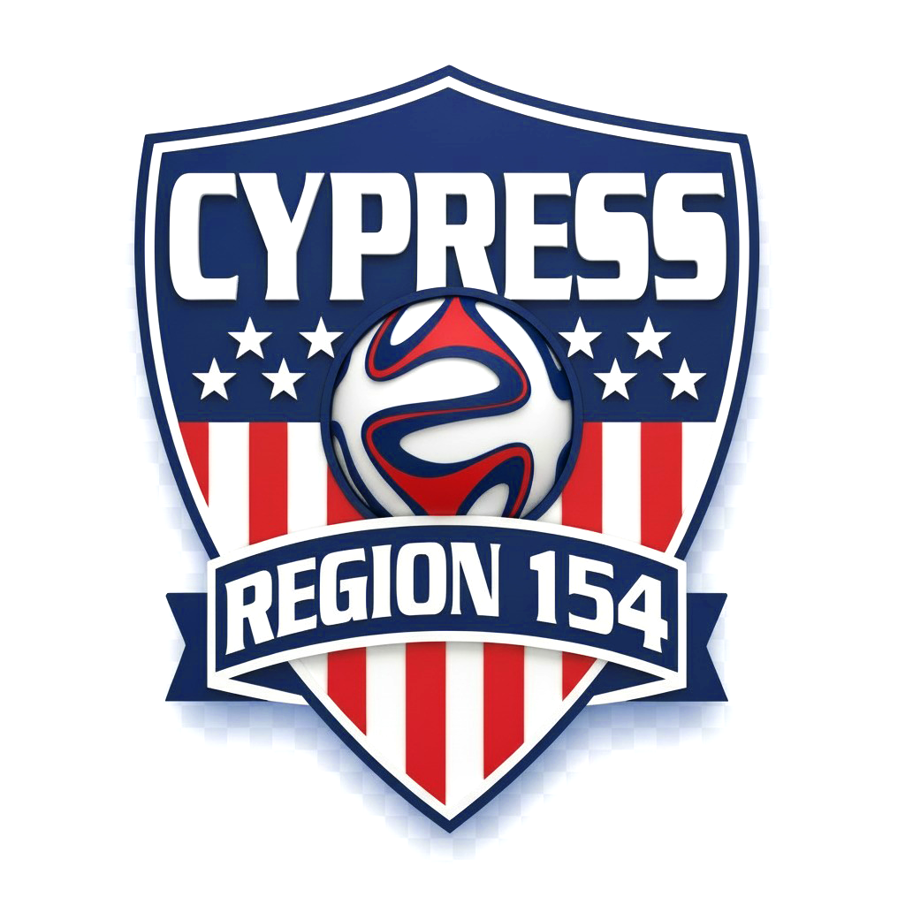



  
  <h1>⚽ AYSO REGION 154 CYPRESS ⚽</h1>
  <h2>Volunteer Standings & Game Day Hub</h2>
  
<em>🏆 Executive Board Review & Saturday Game Day Playbook • Fall 2026</em>

> 🌟 **THE GAME PLAN: 17 POINTS TO PLAYOFFS**  
> Our volunteer system tracks team progress toward the 17-point post-season qualification goal! Saturday QR code check-ins automatically credit referee coverage and field setup shifts while protecting volunteer privacy on the public scoreboard.

---

### 🚀 Game Day Launchpad

| Tool | Direct Access Link | What It Does |
| :--- | :--- | :--- |
| 📱 **Coach Standings** | <a href="https://webmasterayso154.github.io/volunteer-dashboard/" target="_blank" rel="noopener noreferrer"><strong>Open Public Standings Dashboard</strong></a> | Live mobile scoreboard coaches and parents check. |
| 🎛️ **Board Launchpad** | <a href="https://webmasterayso154.github.io/volunteer-dashboard/control-panel.html" target="_blank" rel="noopener noreferrer"><strong>Open Board Control Panel</strong></a> | Visual portal with one-click cards and weekly checklists. |
| 📝 **Volunteer Check-In** | <a href="https://docs.google.com/forms/d/e/1FAIpQLSdDPW8Bs7T1v7xYBIzVmHwi7rpx6rrLcqYk83vvVUJo_j5WSQ/viewform" target="_blank" rel="noopener noreferrer"><strong>Open Game Day Check-In Form</strong></a> | Mobile QR destination for refs, marshals, and field setup. |
| 📋 **Official Response Sheet** | <a href="https://docs.google.com/spreadsheets/d/1NZpCVu0ibHHQ1huBXnjN4SHNB_ahGI998ChVVMypyCk/edit" target="_blank" rel="noopener noreferrer"><strong>Open Master Response Ledger</strong></a> | Google Sheet containing raw Saturday volunteer logs. |
| 📄 **Executive Google Doc** | <a href="https://docs.google.com/document/d/1pf_y8grOjB3V-1_YEng48GpKu97RFjkkcTwxgiImCTA/edit" target="_blank" rel="noopener noreferrer"><strong>Open Formatted Board Playbook Doc</strong></a> | Live collaborative version for the Executive Board. |

---

### ⏱️ Board 2-Minute Pre-Game Test

> **TEST THE LIVE FLOW BEFORE SATURDAY:**
> 1. Open the **Check-In Form** and submit a test entry (*Role: Referee, Field: Lexington #1, Team: 10U - Boys - Michael Lewis*).
> 2. Open the **Live Coach Dashboard** and select **10U - Boys ➔ Michael Lewis**.
> 3. Tap **"↻ Sync"** in the top banner. Confirm the **+1 point** and duty entry appear instantly!

---

### 📋 Weekly Board Operating Routine

| Day & Time | Responsible Role | Game Day Operational Action |
| :--- | :--- | :--- |
| ☕ **Monday Morning** | Referee Admin *(or delegate)* | Cross-reference Saturday game cards in MatchTrak against `Form Responses 1`. Resolve any Center Ref collisions so both teams get proper credit. |
| 📱 **Tuesday Evening** | Coach Admin *(or delegate)* | Check the public dashboard to ensure team point tallies are climbing toward the 17-point goal and answer coach inquiries. |
| 🥅 **Friday Afternoon** | Field Director / Webmaster | Confirm Friday Night Field Setup QR codes are ready at the storage shed so setup crews can log their hours (1 pt/hr). |
| 🏁 **Season Finale** | Regional Commissioner | Open `Admin_Config` in the spreadsheet and check cell **E8 (`StandingsFrozen`)** to lock final seeds for playoff brackets! |

---

### 🥅 Season Point Targets & Category Caps

| Volunteer Duty ⚽ | Max Cap | How Teams Score Points |
| :--- | :---: | :--- |
| **Playoff Requirement** | **17 pts** | Target required for post-season and tournament eligibility. |
| **Referee Assignments** | **10 pts** | Saturday on-field referee assignments (*Dual ARs get 1 pt each; paid NOCRA center refs get 0 pts*). |
| **Friday Night Setup** | **5 pts** | 1 point per hour shift helping line fields, set nets, and place flags. |
| **Field Marshal Shifts** | **2 pts** | Keeping sidelines positive and safe (*can be completed on same day or separate dates*). |
| **Picture Day & Picnic** | **2 pts** | Assisting our young athletes and photographers during picture events. |
| **Certified Ref Bonus** | **5 pts** | Administrative bonus awarded in `Team_Awards` for rostered, certified referees. |
| **MatchTrak Compliance** | **2 pts** | Incentive bonus for coaches with full MatchTrak schedules entered by Sep 26. |

---

### 💡 Frequently Asked Board Questions

* ⚽ **Can we use an official AYSO 154 web address instead of the long GitHub link?**  
  Yes, 100% free[cite: 1]! Because Region 154 owns `ayso154cypress.org` through GoDaddy, we can point a custom sub-domain like `points.ayso154cypress.org` directly to this dashboard[cite: 1]. It costs zero extra dollars, looks trusted to parents, and never interferes with our main SportsConnect site[cite: 1].
* ⚽ **Why not just embed a Google Sheet on our SportsConnect website?**  
  Embedded Google Sheets create three big problems on game day[cite: 1]: (1) A 15-minute delay where parents think their scan failed[cite: 1]; (2) Painful mobile viewing with endless pinching and zooming[cite: 1]; and (3) Privacy risks from exposing volunteer phone numbers and emails on the open web[cite: 1]. The dashboard loads in 1 second and keeps personal contact info hidden[cite: 1].
* ⚽ **Do we have to manually import 4 MatchTrak schedule CSVs every single week?**  
  No[cite: 1]! Manually mapping CSVs is brittle whenever games get rescheduled or rainouts happen. Our automated anomaly engine validates duties on the fly: dual ARs get 1 pt each, NOCRA paid refs get 0 pts, and only true Center Ref conflicts get flagged for a quick review against the game card.
* ⚽ **How do 8U teams earn playoff points if they do not have Field Marshals?**  
  Teams do not need points in every single bucket[cite: 1]. 8U teams reach 17 points easily through Friday Night Field Setup (up to 5 pts), Certified Referee bonuses (up to 5 pts), MatchTrak compliance (2 pts), Picture Day (2 pts), and refereeing upper-division games[cite: 1]!

---

### 🛠️ Observations & Future Form Improvements

| Form Item | Current Approved Form | Proposed Future Revision | Benefit to Region |
| :--- | :--- | :--- | :--- |
| **Team Dropdown** | Split across 3 different questions[cite: 1] | Single team selector at top of form[cite: 1] | Consolidates all points into one clean sheet column[cite: 1]. |
| **Time Slots** | Free-form text ("8", "8am", "8:00")[cite: 1] | Standardized time dropdown list[cite: 1] | Eliminates typos and speeds up Saturday audits[cite: 1]. |
| **Multiple Games** | Single text box[cite: 1] | Checkboxes for match blocks[cite: 1] | Referees working 2 or 3 games can check in once[cite: 1]. |
| **Picture Day** | Omitted from form[cite: 1] | Dedicated shift selection[cite: 1] | Tracks all seasonal volunteer hours in one place[cite: 1]. |

---

### 📝 Board Review & Feedback Tracker

| Board Member | Date | Feedback / Question Observed[cite: 1] | Status / Action Taken |
| :--- | :---: | :--- | :--- |
| **Troy B.** | 9/8 | MatchTrak integration; all fields present? How does 8U sign in with no FM?[cite: 1] | Addressed: Anomaly engine handles pitch checks without CSVs; 8U qualifies via setup & bonus points[cite: 1]. |
| | | | |
